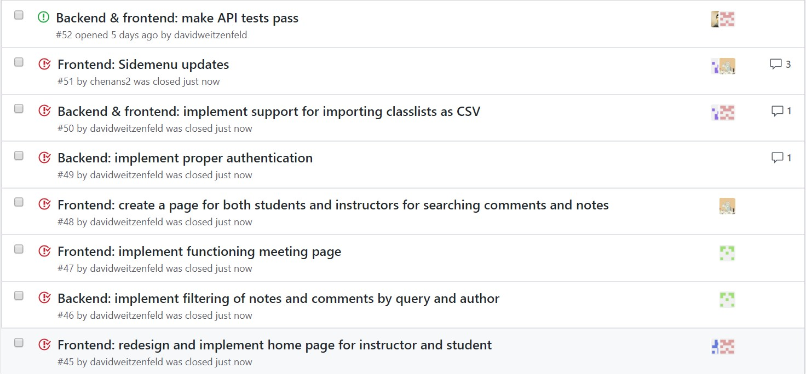
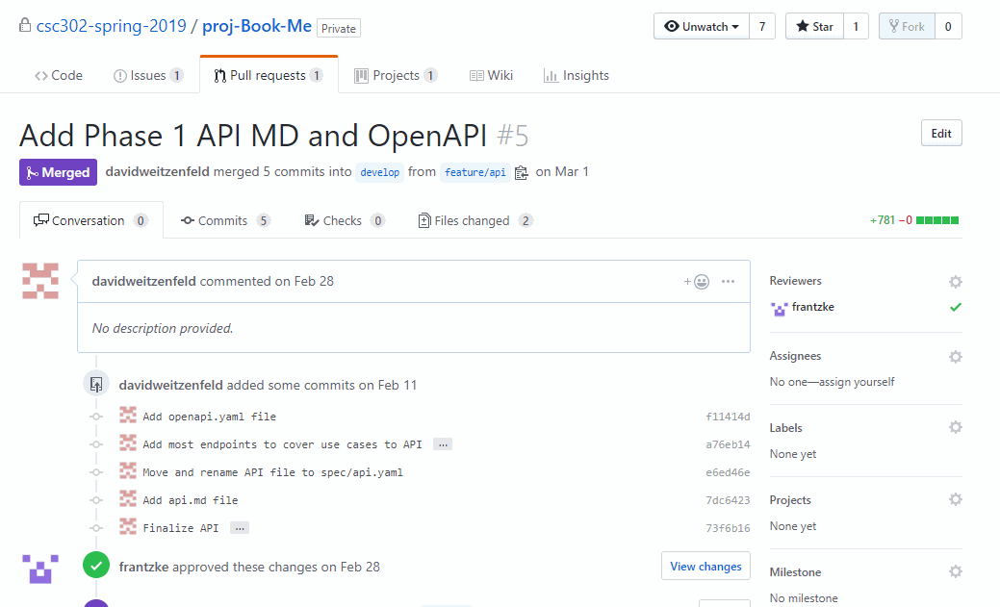

class: center, middle, black-bg

---

class: center, middle, accent-bg

---

class: center, middle, accent-bg

Welcome to the

# Book-Me Office Hours System

---

class: center, middle, accent-bg

# Goals & Features

---

class: left, middle, accent-bg

## Learning Goals

1. Learn to build and test **Angular** applications.
   - Try **Typescript**. Compare **Angular vs. React**.
2. Build a **MongoDB** database.
   - Compare **NoSQL vs. relational**.
3. Integrate front-end with multiple back-ends
   - Implement and use an **REST HTTP API**.
4. Utilize **Trello** to manage tasks.
   - Compare to other task management apps.

???

Some note.

---

class: left, middle, accent-bg

## Initial Features

- Create, edit and delete **courses**.
- Create, edit and delete **office hour blocks**.
- Book and manage **meetings**.
- Create, manage and search **comments & notes**.
- **Import classlist** from CSV file.

???

- State that this is just a summary of the initial features.
- We felt these features were core to the experience.
- They gave us a good variety of objects to implement in MongoDB and set up API calls for

---

class: left, middle, accent-bg

## Achieved Features

- Create, edit and delete **courses/offerings/sections**,
  but not associate with people.
- Create and delete **office hour blocks**.
  - Existing meetings stay.
- Book and delete **meetings**.
- Create and manage **comments & notes**; also kind of search.
- UI for **classlist** import.

---

class: center, middle, accent-bg

# Technology Stack

---

class: center, middle, accent-bg

We used the

## MEAN Stack

**MongoDB** for persistence.

**Express** on a Node.js server in Typescript.

**Angular** front-end with Angular Material UI components.

**Node.js** back-end server.

???

- The MEAN stack provides a great end-to-end framework for building dynamic web applications
- We used the Angular framework for our frontend. Seperating the app into small Angular UI components that allow for isolation of concern and reusability.
- Our HTTP REST API servers will be NodeJS servers that use Express for handling API calls.
- And to store our persistent data, we used MongoDB, a non-relational database hosted on mLab, 
and was queried using API calls (through Mongoose).

---

class: center, middle, accent-bg

# Testing Strategy

---

class: center, middle, accent-bg

## Front-end

---

class: center, middle, accent-bg

## Back-end

**API spec** written in API Blueprint format.
**Dredd** used to test endpoint schema compliance with API spec.
API spec is **single source of truth**.

---

class: center, middle, accent-bg

# Architecture

---

class: center, middle

## General Overview

---

class: center, middle

## Database

---

class: center, middle

## Database

---

class: center, middle

---

class: left, middle, accent-bg

## Front-end

- **Angular** framework.
- **Angular Material** component library with Material Design UI guidelines.
- **Typescript** language.
- **RxJs** for partially functional reactive data-flow.

???

- Our frontend is split into many Angular UI components that allow for isolation of concern and reusability.
- The Angular Material component library follows the Material Design guidelines for a clean and consistent UI across our application, without us having to touch the CSS much.

---

class: left, middle, accent-bg

## Back-end

- **Typescript** for type safety.
- **Express routes** and **JavaScript promises** are used for handling endpoints on the servers
- **Mongo NoSQL database** for persisting all the application's data.

???

- Express routes and JavaScript promises are used for handling endpoints on the servers.
- Our backend uses a Mongo NoSQL database for persisting all the application's data. Both the servers share a single Mongo database so that references from server-office-hours models to server-university models are properly stored as references. This dependency is for things such as storing which class an office hour block is for. This is a one-way dependency, i.e. server-university models have no knowledge of server-office-hours models. See the diagram below to see the dependencies in our models

---

class: center, middle, accent-bg

# Demo

A **demonstration** of our application.

???
You now have a good overview of our technology stack and our architecture.

---

class: center, middle, accent-bg

# Teamwork

---

class: center, middle, accent-bg

## Teamwork

In-person meetings **one-to-three times a week** in class.
Continuous communication through **Slack**.

Task creation, assignment and tracking with **Kanban board**.
First on **Trello**, later switched to **GitHub Issues**

Used **Gitflow workflow** with feature branches, pull requests and code reviews.

???

- Slack was our primary communication tool for questions and updates.
- Each individual feature was seperated and created as a tasks on Trello, allowing easy assignment and tracking of progress.
- Furthermore, each task had its own feature branch, to prevent conflicts and encourage code reviews.

---

class: center, middle, accent-bg

## GitHub Issues

**Summarize issue** and describe what needs to be done.
**Assign** to team members.

.fullwidth[]

---

class: center, middle, accent-bg

## Pull Requests

**Indicate changes** made (**screenshots**) and potential issues.
**Code review** to improve code quality and understanding.

.fullwidth[]

---

class: center, middle, accent-bg

# Insights

---

class: center, middle, accent-bg

## What Went Well

Our chosen tech stack, **MEAN**.
TypeScript and Angular enforced consistency.
Node.js made backend easy.

Our Git workflow, **Gitflow**.
Less conflicts and better separation.

Our continuous communication on **Slack**.
Easy to ask for opinions and help.

???

- The MEAN stack was a great choice as it worked well together and was all in TypeScript.
- Each new task whether implementing a new feature or fixing bugs will have a new branch.
  This eliminates the risk of the app in develop branch from not working.
  Once a task is finished, a pull request is made from the branch for merging into the develop branch.

---

class: center, middle, accent-bg

## What Went Wrong

Tasks often completed **late**.

Not enough thought put into **assigning tasks**.

**MongoDB** made non-trivial queries more complex.

**Not enough tests** and were not always kept up-to-date.

---

class: center, middle, accent-bg

## What We Would Do Differently

More **thought & effort** into **task creation and assignment**.

**Relational database** instead of no-SQL.

**GitHub Issues** over Trello,
with more tagging and referencing.

???

- Improve our efficiency by ordering tasks better and considering which ones need to be completed before others. Tasks were assigned randomly, and thus, we encountered scenarios where a team member was blocked on certain features they were planning to work on, because it depended on another feature that was currently incomplete.
- We used a NoSQL database, MongoDB, but we realized that it would probably have been better to use a relation database since the structure of our data was very relational (office hour blocks relate to course sections, which relate to course offerings, etc.) and as it would have allowed more complex and performant queries (such as filtering based on timestamps, joins, etc.).
- We had problems with teams maintaining the Trello Kanban board and communicating about the items in it. Since Trello was not directly connected to GitHub, while rushing to complete their tasks, updating the Trello board was often forgotten. Futhermore, as Trello does not have a very good system for discussing the items on it, and since, again, it is not connected to GitHub, we had problems with tracking discussions about items on the board, as they were often discussed in the Slack chat.

---

class: center, middle, accent-bg

# Q&A Time

Time for some **questions**.

---

class: center, middle, accent-bg

**CSC302 Team**

Anson Chen, Lukas Frantzke, Nasir Mohammad,  
Kamal Umudlu, David Vajcenfeld and Maximillian Widjaja

# Book-Me Office Hours System

**Thank you for listening**

---

class: center, middle, accent-bg

---

class: center, middle, black-bg
